## Exploratory Data Analysis of US Name Data


What's in a name?  Since 1936 US residents have registered with the Social Security Administration (SSA) and naming data has been collected as a result.  Such naming data is provided online by the SSA and is available for [download](https://www.ssa.gov/oact/babynames/limits.html) at no cost.  In this Jupyter Notebook we explore this name data from which many interesting patterns can be identified.

## Installation

For those interested in downloading the notebook and running the scripts, the [requirements.txt](requirements.txt) file is included. As is customary, the following shell command will ensure the necessary packages are installed to a local virtual environment.  

```
pip install -r requirements.txt
``` 

## Data

The US name data is provided by the Social Security Administration and is divided into comma-delimited text files, with each individual file representing a separate year (1880-2017).   An example of the structure of each file is shown below.

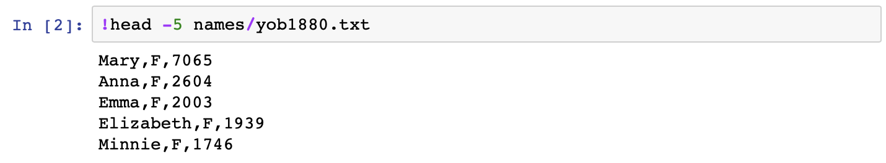

Combining each of these single csv flies into a single dataframe produces 1.9 million rows of data!

## Figures/Data Exploration

Perhaps a visual examination of the data is most helpful to most rapidly gain useful insights.  Let's start with an examination of the number of unique names for each sex in the data set.

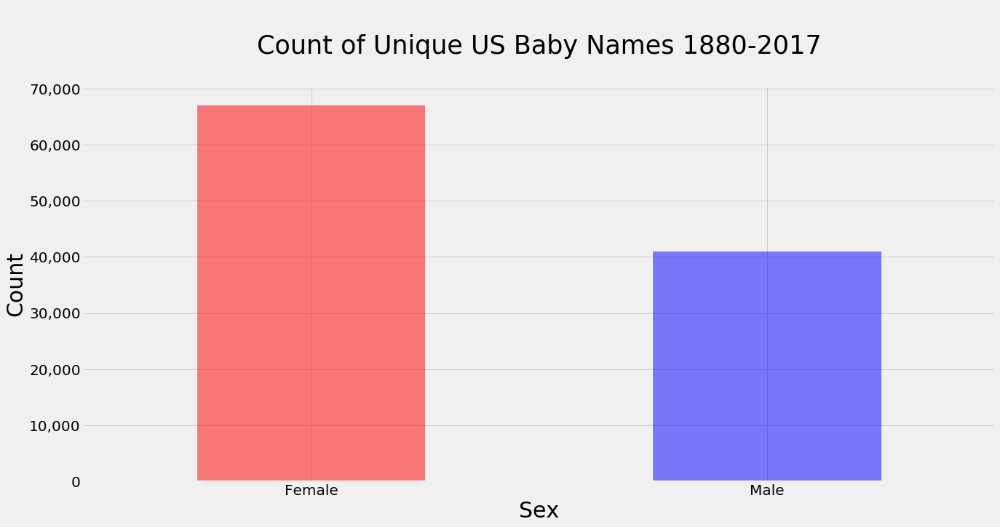  

Let's next examine the number of unique names that appear in the data set for each year.  Two patterns are evident.  1. Aside from few of the early years, the number of unique female names exceeds the number of unique male names for each year. 2. The number of unique names had been increasing until relatively recently. 

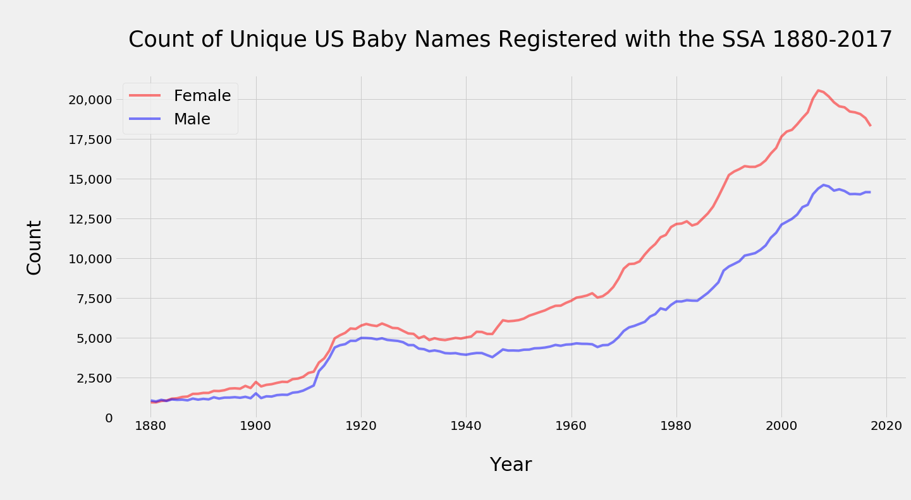

An examination of the total number of names registered with the SSA prior to 1937 is at odds with the [observation](https://www.npr.org/sections/health-shots/2015/03/30/396384911/why-are-more-baby-boys-born-than-girls) that male births outnumber female births.  A variety of explanations could account for the relative higher number of female names registered with the SSA prior to 1937.  The SSA data, however, is consistent with the population statistics known about Baby Boomers, Generation X'ers, and Millennials.

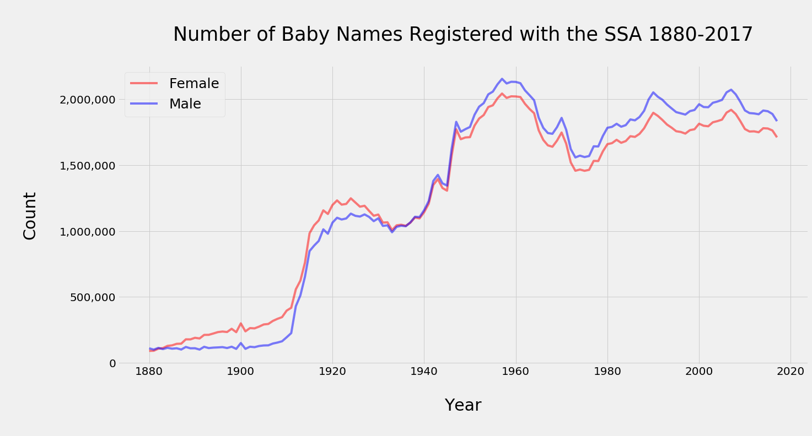

The mean character length of both male and female names had generally been increasing until the 1990s.

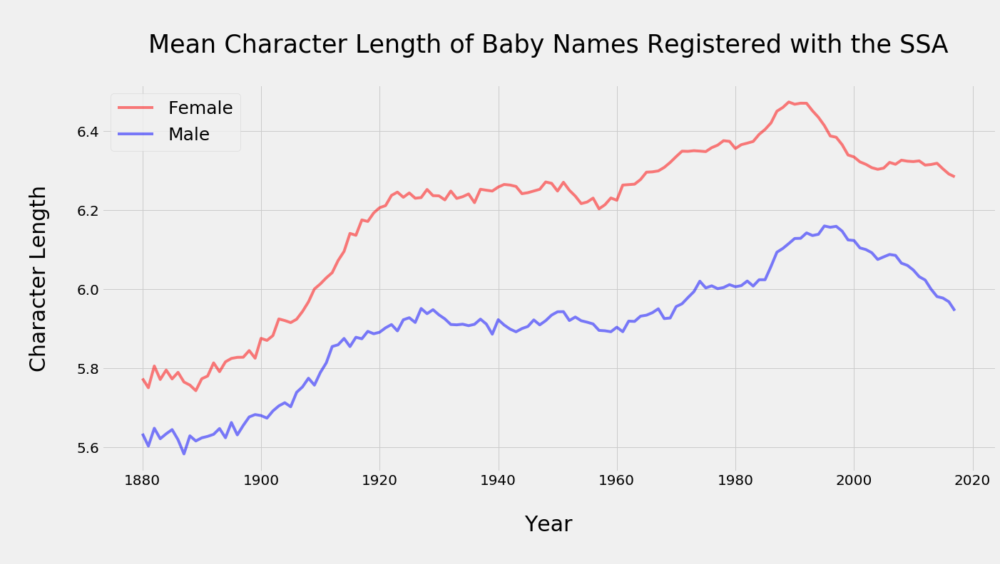

What were the most common names during certain time periods?  A few examples are below.  

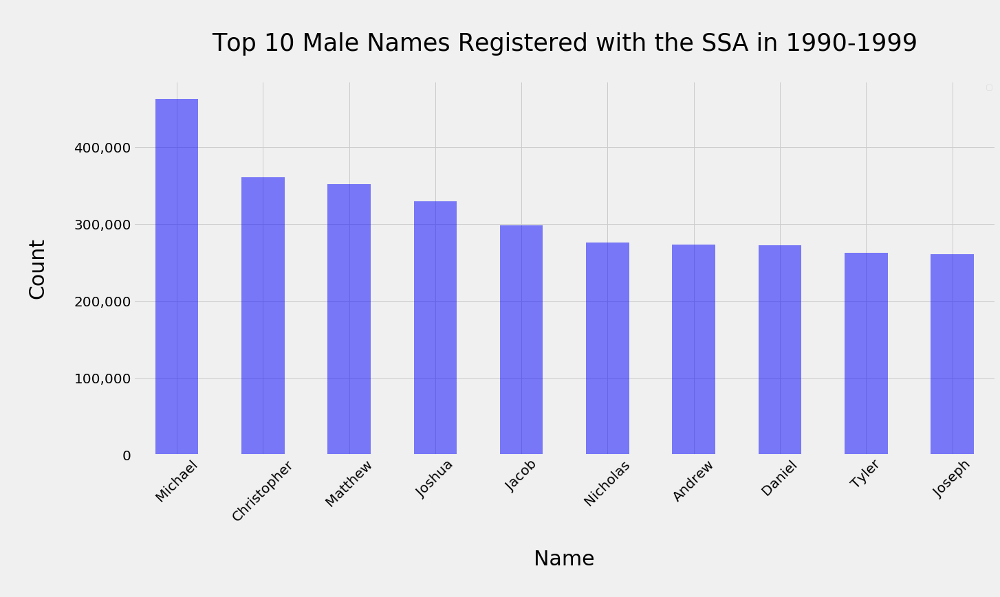

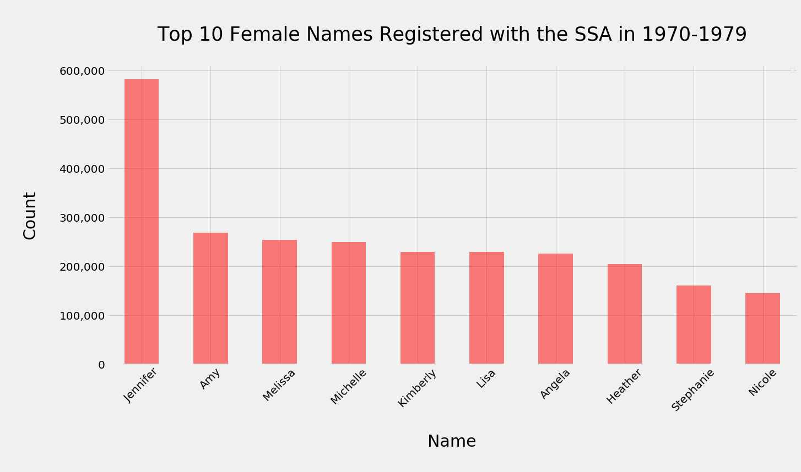

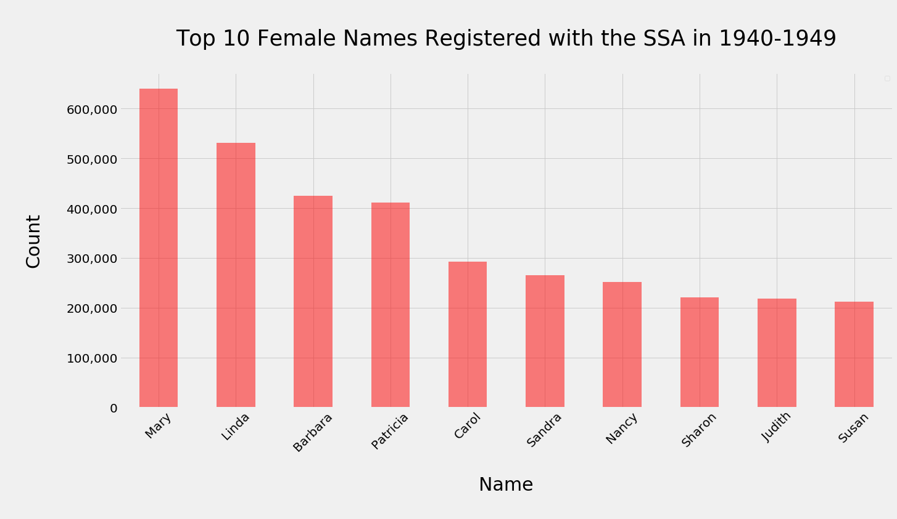

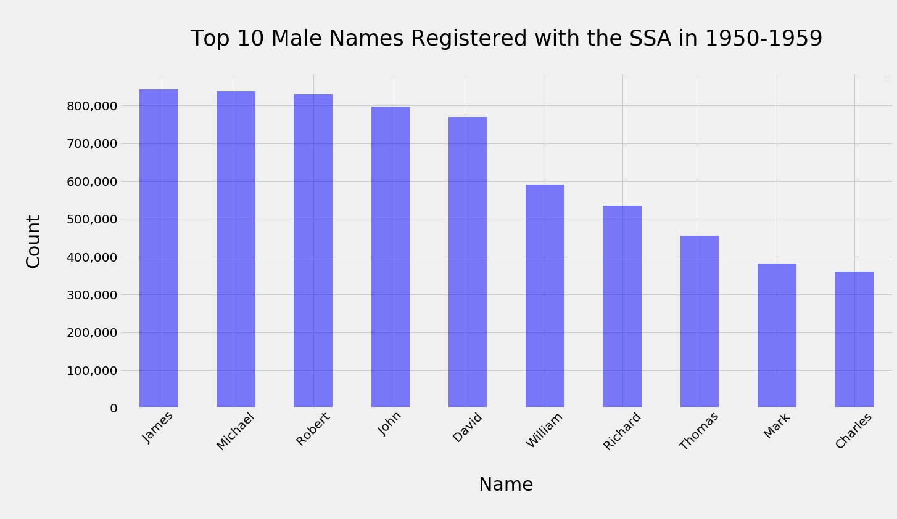

Which names have demonstrated a high degree of balance between male and female?  For names that have a count of at least 1000, the name "Ocean" has the highest degree of gender balance with counts of 1589 for females and 1589 for males.  It is doubtful that "Unknown" is a commonly used name.

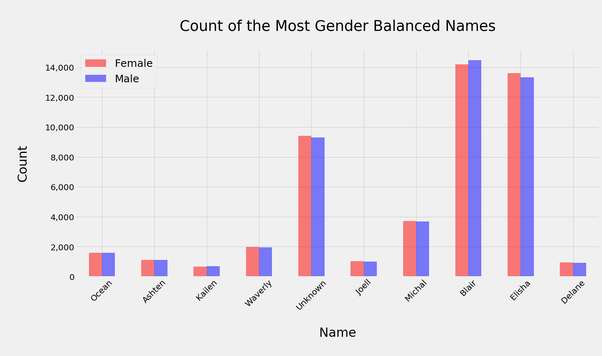

Let's examine if the relative gender balance of a name such as Blair has been constant over time.

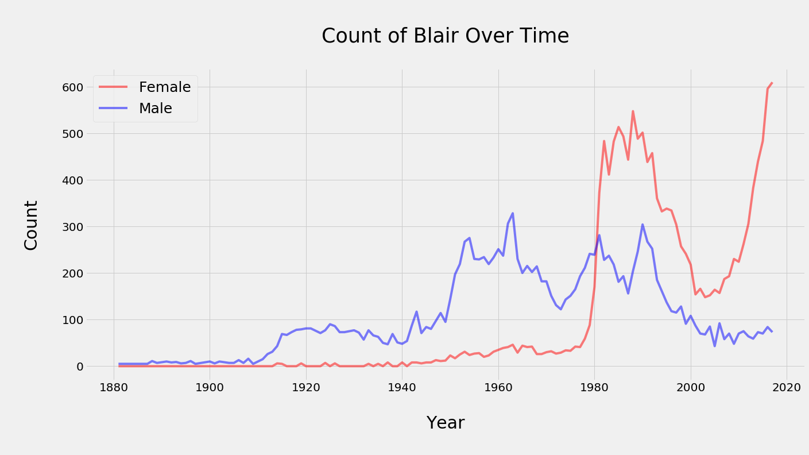


## Conclusion

Many insights can be gained from an analysis of US Social Security Administration name data. Perhaps most evident is that naming conventions are not static, but rather shift with each new generation.
